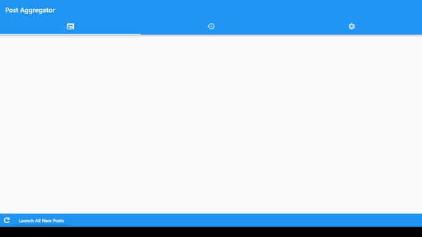

# website_aggregator

A personal project desgined to be a website aggregator. The program gathers 'posts' from various websites, whether through APIs or HTML scraping and displays them in one place. Allows launching said posts in the browser

## Demo

## Architechture

The majority of data processing is handled through the WebsiteFolder object. This object performs functions including:
 - Reading/Writing to files
 - API calls

A \<WebsiteFolder\> object will hold a 2d list of \<Website\> objects in the attribute \<websiteList\>. Index i of websiteList is a list of \<Website\> objects corresponding to the ones dictated by \<websiteTypes\> (index 0 is a list of \<RedditWebsite\>, index 1 is a list of \<GamerPowerWebsite\>, etc.)

Calling WebsiteFolder methods more often than not calls a \<Website\> object method on every \<Website\> object in \<this.websiteList\> and puts together the results.
